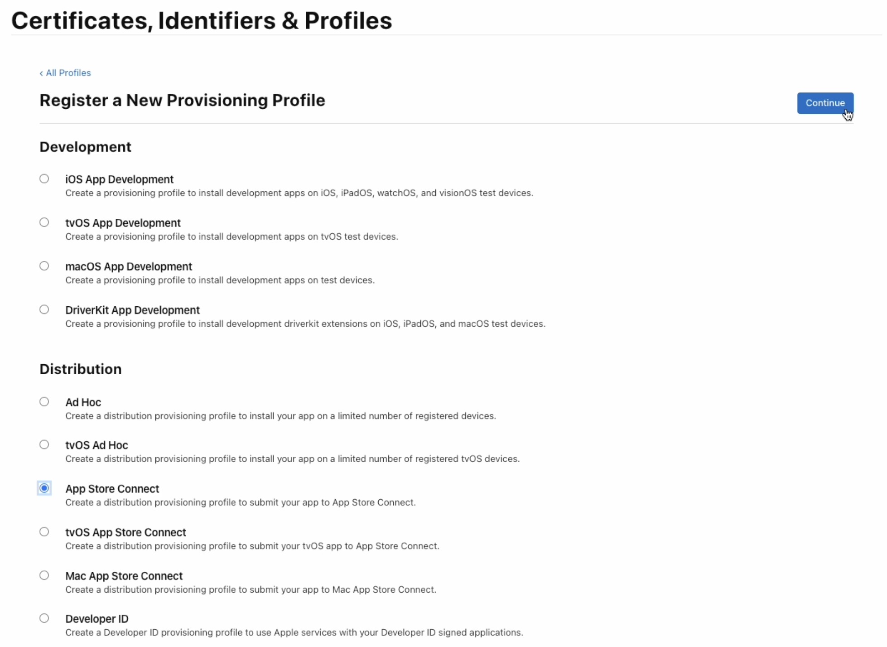
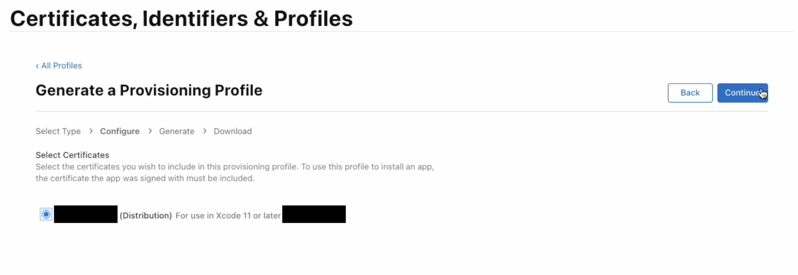

# iOS

1. [Certificat](#certificat)
1. [Créer un identifiant](#identifiant)
1. [Créer un profil](#profil)

## Certificat

### Télécharger le certificat

Aller sur la [liste des certificats](https://developer.apple.com/account/resources/certificates/list) et appuier sur créer un certificat.


Sélectionner `Apple Distribution` (`iOS Distribution` est l'ancien certificat).


[Créer une demande de signature de certificat](https://developer.apple.com/help/account/create-certificates/create-a-certificate-signing-request) avec son email profesionnel, son nom complet, Enregistrée sur le disque puis Continuer

Choisir la demande de signature de certificat (`CertificateSigningRequest.certSigningRequest`) qui vient d'être créer.


Télécharger le certificat (`distribution.cer`).


### Créer le fichier .p12

Ouvrir le certificat (`distribution.cer`).


Exporter le certificat.


Enregistrer.

Saissir un mot de passe et le garder pour [le mettre en secret dans GitHub](#sur-github)


### Sur GitHub

Nomenclature pour les secrets: `ENV_PLATFORM_NAME` par exemple `DEV_IOS_MY_SECRET`

Sur macOS, utiliser cette commande pour avoir le certifact en base64 dans votre presse papier `base64 -i Certificats.p12 | tr -d '\n\r' | pbcopy`.

Créer le secret `DEV_IOS_P12_FILE` dans votre dépôt et coller le certificat.

Créer le secret `DEV_IOS_P12_PASSWORD` dans votre dépot et coller le mot de passe du certificat.

```bash
keychainPassword=$(openssl rand -base64 50)
security create-keychain -p "$keychainPassword" temp.keychain
security set-keychain-settings -lut 21600 temp.keychain
security unlock-keychain -p "$keychainPassword" temp.keychain

echo "${{ secrets.DEV_IOS_P12_FILE }}" | base64 --decode > certificat.p12
security import certificat.p12 -P "${{ secrets.DEV_IOS_P12_PASSWORD }}" -A -t cert -f pkcs12 -k temp.keychain
security list-keychain -d user -s temp.keychain

security set-key-partition-list -S apple-tool:,apple: -s -k "$keychainPassword" temp.keychain
```

## Identifiant

Aller sur la [liste des identifiants](https://developer.apple.com/account/resources/identifiers/list) et appuier sur créer un identifiant.


Sélectionner `App IDs`.


Sélectionner `App`.


Saisir une description, le bundle ID Explicit (Chercher PRODUCT_BUNDLE_IDENTIFIER dans votre projet) et enregistrer.


## Profil

Aller sur la [liste des profils](https://developer.apple.com/account/resources/profiles/list) et appuier sur générer un profil.


Sélectionner `Distribution` -> `App Store Connect`.



Sélectionner l'`App ID` de l'application.


Sélectionner le [certificat créé plus haut](#certificat).



Écrire un nom, générer et télécharger.


### Sur GitHub

Nomenclature pour les secrets: `ENV_PLATFORM_NAME` par exemple `DEV_IOS_MY_SECRET`

Sur macOS, utiliser cette commande pour avoir le profil en base64 dans votre presse papier `base64 -i profile.mobileprovision | tr -d '\n\r' | pbcopy`.

Créer le secret `DEV_IOS_PROFILE` dans votre dépôt et coller le profil.

```bash
echo ${{ secrets.DEV_IOS_PROFILE }} | base64 --decode > profile.mobileprovision
mkdir -p ~/Library/MobileDevice/Provisioning\ Profiles
cp profile.mobileprovision ~/Library/MobileDevice/Provisioning\ Profiles/profile.mobileprovision
```

### Sur XCode

Décocher `Automatically manage signing`.


Importer le profil.


### ExportOptions

Ce fichier sert à faire le lien avec le profil ajouté avant

```xml
<?xml version="1.0" encoding="UTF-8"?>
<!DOCTYPE plist PUBLIC "-//Apple//DTD PLIST 1.0//EN" "http://www.apple.com/DTDs/PropertyList-1.0.dtd">
<plist version="1.0">
    <dict>
        <key>method</key>
        <string>app-store</string>
        <key>provisioningProfiles</key>
        <dict>
            <key>com.company.example</key>
            <string>example_app_store_profile</string>
        </dict>
        <key>signingCertificate</key>
        <string>Apple Distribution: CertificateName</string>
        <key>signingStyle</key>
        <string>manual</string>
        <key>teamID</key>
        <string>ABCDEFGHIJ</string>
    </dict>
</plist>
```

#### Sur GitHub

Nomenclature pour les secrets: `ENV_PLATFORM_NAME` par exemple `DEV_IOS_MY_SECRET`

Sur macOS, utiliser cette commande pour avoir le profil en base64 dans votre presse papier `base64 -i profile.mobileprovision | tr -d '\n\r' | pbcopy`.

Créer le secret `DEV_IOS_EXPORT_OPTIONS` dans votre dépôt et coller le fichier d'export options.

```bash
echo ${{ secrets.DEV_IOS_EXPORT_OPTIONS }} | base64 --decode > exportOptions.plist
```

et lorsque vous construiser l'app ajoutez `--export-options-plist exportOptions.plist`

```bash
flutter build ipa --export-options-plist exportOptions.plist
```